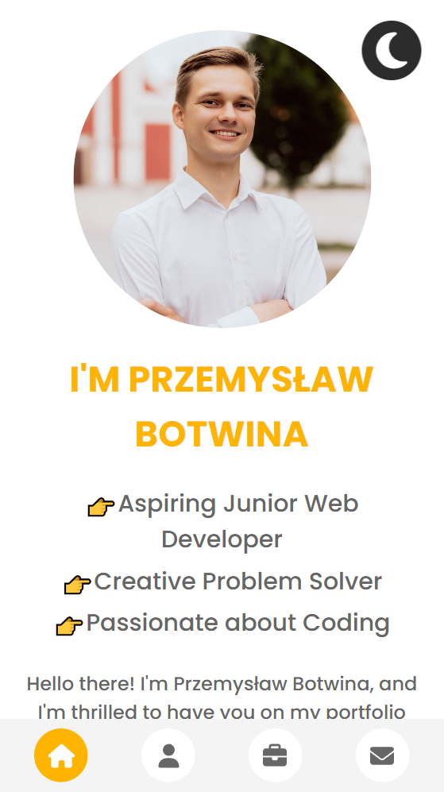

# My portfolio

   

## Overview

Hello there! I'm Przemysław Botwina, and I'm thrilled to have you on my GitHub. As an aspiring Junior Web Developer, I'm on a mission to turn innovative ideas into functional and visually stunning websites. Here, you'll get a glimpse of my skills, projects, and a little insight into what drives my passion for web development.

## Screenshot

## Links

- GitHub repository: [https://github.com/WersV/my-portfolio](https://github.com/WersV/my-portfolio)
- GitHub Pages: [https://wersv.github.io/my-portfolio/](https://wersv.github.io/my-portfolio/)

## Author

- My GitHub profile - [Przemysław Botwina](https://github.com/WersV)
